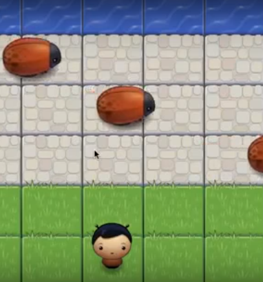

# Arcade Game Project
The Arcade Game Project is all about demonstrating my skills of JavaScript specially OOP. 
## Getting Started
Download the zip file or clone via Github

## Prerequisites
You will only need your browser.

## Table of Contents

* [How To Play](#how_to_play)
* [Instructions](#instructions)
* [Dependencies](#dependencies)
* [Contributing](#contributing)

## How To Play
* The player can move left, right, up and down.
* The enemies move at varying speeds on the paved block portion of the game board.
* Once a the player collides with an enemy, the game is reset and the player moves back to the starting square.
* Once the player reaches the water (i.e., the top of the game board), the game is won.

## Dependencies

* None

## Contributing

This repository is the starter code for _all_ Udacity students. Therefore, we most likely will not accept pull requests.

